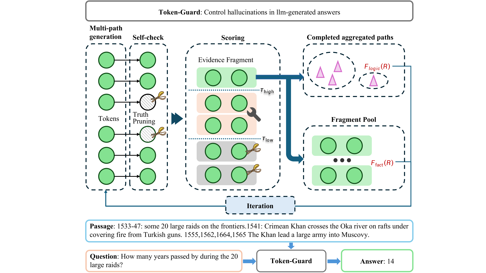
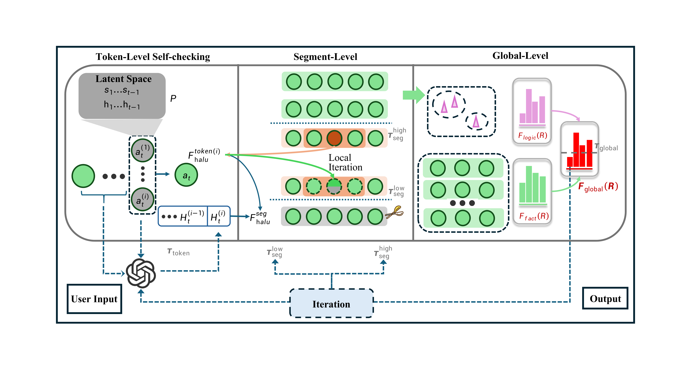

# Token-Guard

Official resources of **"TOKEN-GUARD: TOWARDS TOKEN-LEVEL HALLUCINATION CONTROL VIA SELF-CHECKING DECODING"**. [**ICLR 2026**].
Official resources of **"TOKEN-GUARD: TOWARDS TOKEN-LEVEL HALLUCINATION CONTROL VIA SELF-CHECKING DECODING"**. Yifan Zhu, Huiqiang Rong, Haoran Luo. **ICLR 2026** \[[paper](Coming Soon)\].


## Overview

**Token-Guard** is a modular, decoding-based framework designed to mitigate hallucinations in Large Language Models (LLMs) through a three-stage self-checking pipeline. By performing internal verification at each reasoning step, it detects and prunes hallucinated tokens before they propagate into the final output.




## Environment Setup

```bash
conda create -n tokenguard python=3.10
conda activate tokenguard
pip install -r requirements.txt
```

## Quick Start

The entire pipeline is streamlined into two simple steps: running the experiments and calculating the metrics.

### 1. Run Baseline Experiments

Execute the automated bash script to generate reasoning trajectories for all benchmarks (e.g., HaluEval, DROP, RAGTruth).

> **Note:** Please ensure the `--model_path` in the script is correctly set to your local model directory (e.g., `./models/Meta-Llama-3.1-8B-Instruct`).

```bash
bash run_baseline_all.sh
```

### 2. Evaluation & Metric Calculation

Once the experiments are complete, run the evaluation script to calculate F1 scores, Exact Match (EM), and hallucination rates.

> **Note:** Before running, update the `data_path` and `result_path` in `eval/eval.py` to point to your specific result folders.

```bash
python eval/eval.py
```

## Experimental Results

Token-Guard achieves significant performance gains across multiple benchmarks, effectively mitigating hallucinations across various reasoning tasks.

## BibTex

If you find this work is helpful for your research, please cite:

```bibtex
@inproceedings{tokenguard2026,
      title={TOKEN-GUARD: TOWARDS TOKEN-LEVEL HALLUCINATION CONTROL VIA SELF-CHECKING DECODING}, 
      author={Yifan Zhu, Huiqiang Rong, Haoran Luo},
      booktitle={International Conference on Learning Representations (ICLR)},
      year={2026},
      url={https://github.com/rhq945/Token-Guard}
}

```

For further questions, please contact: [rhq@bupt.edu.cn].

---
